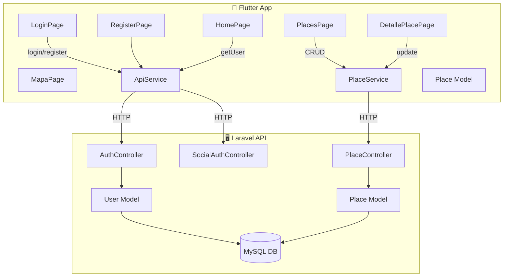

# 📊 Análisis del Proyecto — GeoPlaces (Flutter + Laravel)

Comparación contra los **7 requisitos del proyecto de primera unidad** de DBPI.

---

## Resumen de Cumplimiento

| # | Requisito | Estado | Nota |
|---|-----------|--------|------|
| 1 | **Autenticación** | 🟡 Parcial | Falta recuperación de contraseña |
| 2 | **CRUD completo** | 🟡 Parcial | Falta **subida de imágenes** |
| 3 | **Captura de imágenes** | 🔴 No implementado | No usa `image_picker` |
| 4 | **Geolocalización** | ✅ Completo | GPS + mapa + coordenadas guardadas |
| 5 | **Integración con apps externas** | 🟡 Parcial | Solo abre Google Maps. Faltan WhatsApp, llamadas, navegador |
| 6 | **Sensores del celular** | 🔴 No implementado | No usa `sensors_plus` |
| 7 | **Mensajería o notificaciones** | 🔴 No implementado | No usa notificaciones locales ni push |

**Resultado global: 1/7 completo, 3/7 parciales, 3/7 sin implementar.**

---

## 1. Autenticación

| Sub-requisito | Estado | Archivo/Evidencia |
|---|---|---|
| Login | ✅ | [login_page.dart](file:///c:/Users/ACER/Documents/UNIVERSIDAD/IV%20SEMESTRE/DBPI/C2%20-%20FLUTTER%20CON%20LARAVEL/flutter_laravel_api/lib/screens/login_page.dart) → `ApiService.login()` |
| Registro | ✅ | [register_page.dart](file:///c:/Users/ACER/Documents/UNIVERSIDAD/IV%20SEMESTRE/DBPI/C2%20-%20FLUTTER%20CON%20LARAVEL/flutter_laravel_api/lib/screens/register_page.dart) → `ApiService.register()` |
| Recuperación de contraseña | ❌ | El botón "¿Olvidaste tu contraseña?" existe en la UI pero `onPressed` está vacío (`() {}`) |
| Login con Google | ✅ | [api_service.dart](file:///c:/Users/ACER/Documents/UNIVERSIDAD/IV%20SEMESTRE/DBPI/C2%20-%20FLUTTER%20CON%20LARAVEL/flutter_laravel_api/lib/services/api_service.dart#L98-L129) → `loginWithGoogle()` usando `google_sign_in` |

> [!WARNING]
> **Falta:** Implementar la funcionalidad de recuperación de contraseña. Necesitas:
> - En Laravel: un endpoint `POST /api/forgot-password` que envíe un email/código.
> - En Flutter: una pantalla para ingresar el correo y otra para ingresar el código + nueva contraseña.

---

## 2. CRUD Completo (Places / Lugares Turísticos)

| Operación | Estado | Flutter | Laravel |
|---|---|---|---|
| **Crear** | ✅ | [places_page.dart](file:///c:/Users/ACER/Documents/UNIVERSIDAD/IV%20SEMESTRE/DBPI/C2%20-%20FLUTTER%20CON%20LARAVEL/flutter_laravel_api/lib/screens/places_page.dart#L42-L70) → `PlaceService.createPlace()` | `POST /api/places` → [PlaceController::store](file:///c:/Users/ACER/Documents/UNIVERSIDAD/IV%20SEMESTRE/DBPI/C2%20-%20FLUTTER%20CON%20LARAVEL/laravel_api/app/Http/Controllers/PlaceController.php#L19-L31) |
| **Listar** | ✅ | `PlaceService.getPlaces()` | `GET /api/places` → `PlaceController::index` |
| **Editar** | ✅ | [detalle_place_page.dart](file:///c:/Users/ACER/Documents/UNIVERSIDAD/IV%20SEMESTRE/DBPI/C2%20-%20FLUTTER%20CON%20LARAVEL/flutter_laravel_api/lib/screens/detalle_place_page.dart#L84-L201) → modal de edición | `PUT /api/places/{id}` → `PlaceController::update` |
| **Eliminar** | ✅ | `PlaceService.deletePlace()` con confirmación | `DELETE /api/places/{id}` → `PlaceController::destroy` |
| **Subida de imágenes** | ❌ | No implementado | No hay campo `image` en la tabla `places` |

> [!IMPORTANT]
> **Falta:** Subida de imágenes al crear/editar un lugar. Necesitas:
> - En la migración de Laravel: agregar un campo `image` (string/nullable) a la tabla `places`.
> - En el `PlaceController`: manejar la subida del archivo con `$request->file('image')`.
> - En Flutter: usar `image_picker` para seleccionar la imagen y enviarla como `multipart/form-data`.

---

## 3. Captura de Imágenes 🔴

**No implementado.** No existe ningún uso de cámara o galería en el proyecto.

Lo que se necesita:
- **Paquete:** `image_picker` (no está en [pubspec.yaml](file:///c:/Users/ACER/Documents/UNIVERSIDAD/IV%20SEMESTRE/DBPI/C2%20-%20FLUTTER%20CON%20LARAVEL/flutter_laravel_api/pubspec.yaml))
- Integrar la captura de imagen con el formulario de crear/editar lugar
- Permitir elegir entre **cámara** y **galería**

> [!NOTE]
> Este requisito se puede cumplir al mismo tiempo que "Subida de imágenes" del punto 2. Al agregar `image_picker`, se resuelven **dos requisitos de golpe**.

---

## 4. Geolocalización ✅

| Sub-requisito | Estado | Evidencia |
|---|---|---|
| Obtener coordenadas | ✅ | `Geolocator.getCurrentPosition()` en [places_page.dart](file:///c:/Users/ACER/Documents/UNIVERSIDAD/IV%20SEMESTRE/DBPI/C2%20-%20FLUTTER%20CON%20LARAVEL/flutter_laravel_api/lib/screens/places_page.dart#L190-L238) |
| Mostrar ubicación actual | ✅ | Marcador azul en [mapa_page.dart](file:///c:/Users/ACER/Documents/UNIVERSIDAD/IV%20SEMESTRE/DBPI/C2%20-%20FLUTTER%20CON%20LARAVEL/flutter_laravel_api/lib/screens/mapa_page.dart#L106-L138) |
| Guardar lat/lng | ✅ | Se guardan en la BD vía API al crear un place |
| Mostrar mapa | ✅ | Usa `flutter_map` (OpenStreetMap) en mapa completo y mini-mapa en detalle |

**Paquetes usados:**
- `geolocator: ^13.0.4` ✅
- `flutter_map: ^7.0.2` ✅ (alternativa a `google_maps_flutter`)
- `latlong2: ^0.9.1` ✅

**Este es el requisito mejor implementado de todo el proyecto.** 👏

---

## 5. Integración con Aplicaciones Externas

| Integración | Estado | Evidencia |
|---|---|---|
| Abrir Google Maps | ✅ | [detalle_place_page.dart](file:///c:/Users/ACER/Documents/UNIVERSIDAD/IV%20SEMESTRE/DBPI/C2%20-%20FLUTTER%20CON%20LARAVEL/flutter_laravel_api/lib/screens/detalle_place_page.dart#L75-L82) → `_abrirEnGoogleMaps()` con `url_launcher` |
| Abrir WhatsApp con mensaje | ❌ | No implementado |
| Abrir llamadas telefónicas | ❌ | No implementado |
| Abrir navegador web | ❌ | No implementado |

**Paquete disponible:** `url_launcher: ^6.3.1` ya está instalado, solo falta usarlo para los otros 3 casos.

> [!TIP]
> Esto es rápido de implementar. Con `url_launcher` que ya tienes, son básicamente:
> ```dart
> // WhatsApp
> launchUrl(Uri.parse('https://wa.me/593XXXXXXXXX?text=Hola'));
> // Llamada
> launchUrl(Uri.parse('tel:+593XXXXXXXXX'));
> // Navegador
> launchUrl(Uri.parse('https://ejemplo.com'));
> ```
> Se pueden agregar como botones en la pantalla de detalle del lugar.

---

## 6. Sensores del Celular 🔴

**No implementado.** No hay ningún uso de acelerómetro, giroscopio, brújula, etc.

Lo que se necesita:
- **Paquete:** `sensors_plus` (no está en pubspec.yaml)
- Elegir **un sensor** (recomiendo la **brújula** porque encaja temáticamente con la app de geolocalización)
- Crear una pantalla o widget que muestre los datos del sensor en tiempo real

---

## 7. Mensajería o Notificaciones 🔴

**No implementado.** No hay notificaciones de ningún tipo.

Opciones para implementar:
- **Opción más simple:** `flutter_local_notifications` → mostrar una notificación local cuando se guarde un lugar nuevo
- **Opción más completa:** Firebase Messaging (push notifications)

---

## Paquetes Actuales vs Requeridos

| Paquete | En `pubspec.yaml` | Requisito que cubre |
|---|---|---|
| `http` | ✅ | Comunicación con API REST |
| `shared_preferences` | ✅ | Persistencia de token |
| `geolocator` | ✅ | Geolocalización |
| `flutter_map` | ✅ | Mapa (alternativa a google_maps) |
| `latlong2` | ✅ | Coordenadas para flutter_map |
| `url_launcher` | ✅ | Integraciones externas |
| `google_sign_in` | ✅ | Login con Google |
| `image_picker` | ❌ **Falta** | Captura de imágenes (cámara/galería) |
| `sensors_plus` | ❌ **Falta** | Sensores del celular |
| `flutter_local_notifications` | ❌ **Falta** | Notificaciones |

---

## 🎯 Plan de Acción Priorizado

Para completar el proyecto, estos son los cambios ordenados por **impacto** (resuelve más requisitos) y **facilidad**:

### Prioridad 1 — Imágenes (cubre requisitos 2 + 3)
1. Agregar campo `image` a la tabla `places` en Laravel
2. Modificar `PlaceController` para manejar subida de archivos
3. Agregar `image_picker` a Flutter
4. Modificar el formulario de crear/editar lugar para capturar foto (cámara o galería)
5. Mostrar la imagen en la tarjeta y detalle del lugar

### Prioridad 2 — Integraciones externas (completar requisito 5)
1. Agregar botones en detalle del lugar: "Compartir por WhatsApp", "Llamar", "Ver en navegador"
2. Usar `url_launcher` (ya instalado)

### Prioridad 3 — Sensores (requisito 6)
1. Agregar `sensors_plus` al `pubspec.yaml`
2. Crear una pantalla/widget de **brújula** que muestre la dirección hacia el lugar guardado

### Prioridad 4 — Notificaciones (requisito 7)
1. Agregar `flutter_local_notifications`
2. Mostrar notificación local al guardar un nuevo lugar exitosamente

### Prioridad 5 — Recuperación de contraseña (completar requisito 1)
1. Crear endpoint `POST /api/forgot-password` en Laravel
2. Crear pantalla en Flutter para solicitar recuperación

---

## Arquitectura Actual



## Estructura de Archivos Actual

```
flutter_laravel_api/lib/
├── main.dart
├── models/
│   └── place_model.dart
├── screens/
│   ├── login_page.dart         ← Auth: Login + Google
│   ├── register_page.dart      ← Auth: Registro
│   ├── home_page.dart          ← Dashboard principal
│   ├── places_page.dart        ← CRUD: Listar + Crear + Eliminar
│   ├── detalle_place_page.dart ← CRUD: Ver + Editar + url_launcher
│   └── mapa_page.dart          ← Geolocalización: Mapa completo
└── services/
    ├── api_service.dart        ← Auth HTTP calls
    └── place_service.dart      ← Places HTTP calls

laravel_api/
├── app/Http/Controllers/
│   ├── AuthController.php       ← register, login, logout
│   ├── PlaceController.php      ← CRUD places
│   └── SocialAuthController.php ← Google OAuth
├── app/Models/
│   ├── User.php
│   └── Place.php
├── database/migrations/
│   ├── create_users_table.php
│   ├── create_places_table.php
│   ├── create_personal_access_tokens_table.php
│   ├── add_google_id_to_users_table.php
│   └── add_apellido_to_users_table.php
└── routes/api.php               ← Rutas REST
```

---

> [!IMPORTANT]
> **¿Quieres que implemente las funcionalidades faltantes?** Puedo empezar por la Prioridad 1 (imágenes) que resuelve 2 requisitos de golpe, o por cualquier otro punto que prefieras. Dime por cuál quieres empezar y lo implemento.
